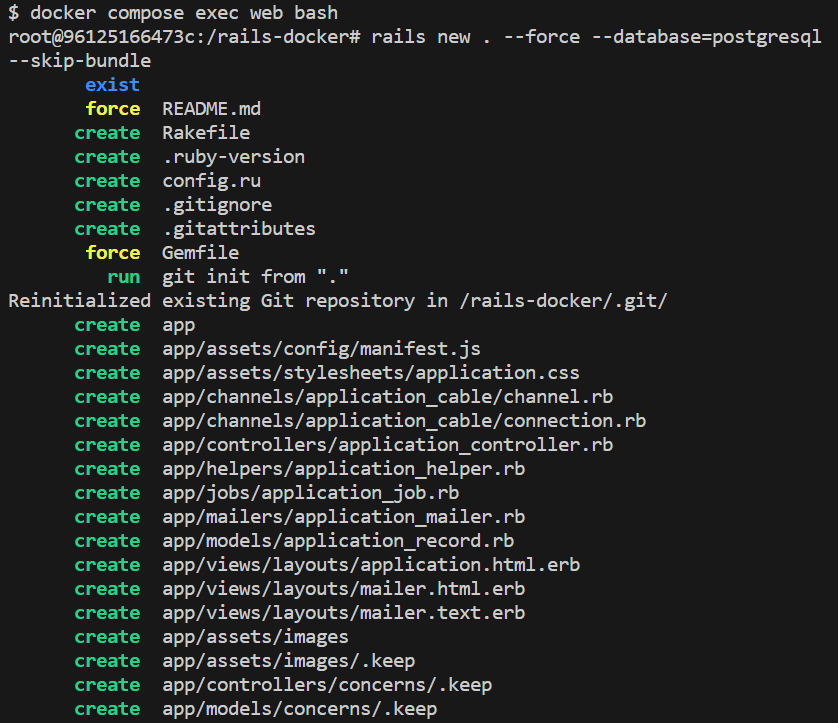
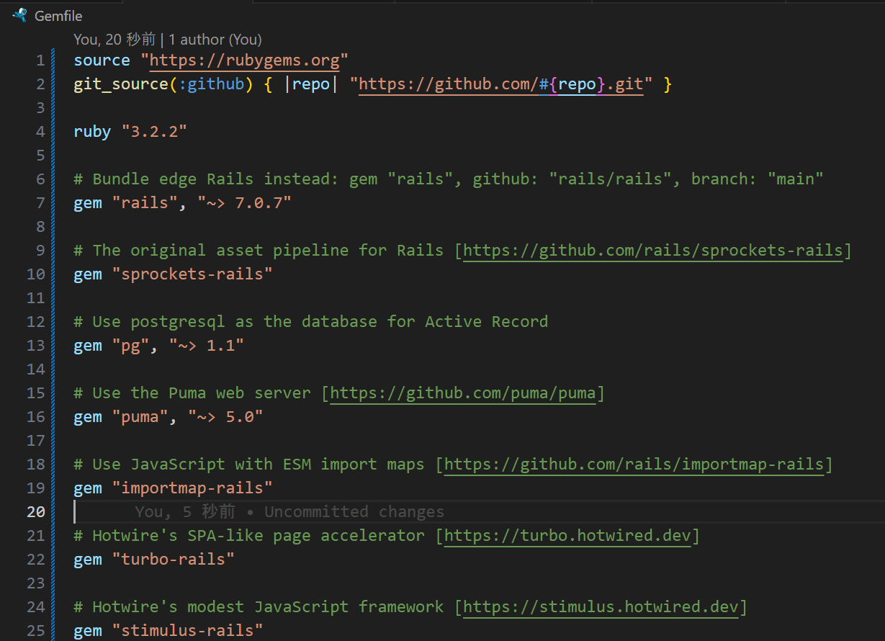
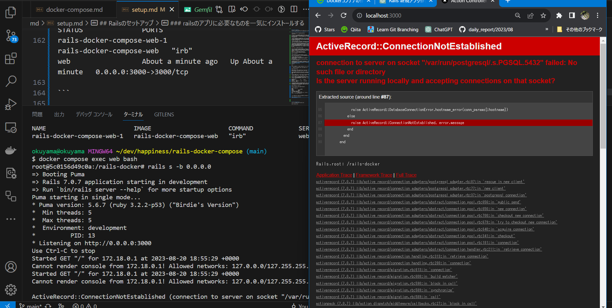

##　ファイル作成後にまずやること
```
docker-compose up -d
```
コマンドの解説
-dは「ディタッチモード」（Detached Mode）
「docker-compose up -d」というコマンドは、Docker Composeを使用して定義されたコンテナをバックグラウンドで起動するためのコマンドです。

docker-compose: Docker Composeコマンドの基本部分です。
up: Docker Composeによって定義されたコンテナを起動するためのオプションです。
-d: バックグラウンドでコンテナを実行するためのオプションです。このオプションを指定することで、コンテナが端末セッションに影響を与えずに実行されます。

ディタッチモードで実行したコンテナは、後から「docker logs」コマンドなどを使用してログを確認することができます。また、必要に応じて「docker stop」コマンドを使用してコンテナを停止させることもできます。

ディタッチモードを使用する際には、コマンドやツールによってはログや出力がターミナルに表示されないため、正常に動作しているかどうかを確認する場合はログや他の手段を活用する必要があります。
### 実行結果画像


Docker Compose設定ファイルの読み込み: docker-compose up -d コマンドを実行すると、カレントディレクトリにある docker-compose.yml ファイル（設定ファイル）が読み込まれます。

イメージのビルドまたは取得: 設定ファイルには、使用するDockerイメージの情報が記述されていることが一般的です。もしそのイメージがホスト上に存在しない場合、Dockerはイメージを取得（ダウンロード）します。また、設定ファイルにビルド指示が含まれている場合、Dockerは指定されたソースコードからイメージをビルドします。

コンテナの作成と起動: イメージが用意されたら、Dockerはそれを基に新しいコンテナを作成します。設定ファイルには、コンテナの設定や依存関係が含まれており、それに従ってコンテナが構築されます。これにはネットワークの設定、ボリュームのマウント、環境変数の設定などが含まれます。

コンテナの起動: コンテナが作成されたら、-d オプションによりバックグラウンドでコンテナが起動されます。これにより、コンテナがバックグラウンドで実行され、ターミナルセッションがブロックされることなく他の作業を続けることができます。

docker-compose up -d を実行することで、設定ファイルに記述された複数のコンテナが必要な設定で作成され、それらがバックグラウンドで起動されます。これにより、複雑なアプリケーション環境を簡単に構築し、実行することが可能となります。

### docker psで実行中のDockerコンテナの一覧を表示
```
docker ps
```
実行中のDockerコンテナの一覧を表示するためのコマンドです。

```
docker ps -a
```
実行中のコンテナだけでなく、停止中のコンテナも含めてすべてのコンテナの情報を表示することができます。
```
docker ps -a
CONTAINER ID   IMAGE                      COMMAND   CREATED          STATUS          PORTS                    NAMES
96125166473c   rails-docker-compose-web   "irb"     15 minutes ago   Up 15 minutes   0.0.0.0:3000->3000/tcp   rails-docker-compose-web-1

```

### 実行中の複数のコンテナを削除
コンテナが実行中である場合、削除する前にコンテナを停止する必要があります。コンテナを停止するには、docker stop コマンドを使用します。
```
docker stop container1 container2
```
```
docker rm container1 container2
```
### Dockerシステム内の未使用のリソースを一括で削除するためのコマンド
```
docker system prune
```
具体的には、以下のようなリソースを削除することができます：
- 未使用の停止中のコンテナ
- 未使用のネットワーク
- 未使用のイメージ（Dockerイメージのキャッシュやダングリングイメージ）
- 未使用のボリューム（Dockerボリューム）


### コンテナに入って作業するコマンド
```
docker-compose exec web bash
```
lsでコンテナの中を確認
```
$ docker-compose exec web bash
root@96125166473c:/rails-docker# ls
Docker-compose.yml  Dockerfile  Gemfile  Gemfile.lock  images  md
root@96125166473c:/rails-docker#
```
コンテナから抜ける
```
exit
```

### 途中から作業を再開する場合
1.初めにDockerエンジンを手動で起動する(dockerアプリを開く)

2.コンテナを起動させる(ExitedからRunningにする)
```
docker start <CONTAINER IDまたはNAME>
```
コンテナの停止(RunningからExitedにする)
```
docker stop <CONTAINER IDまたはNAME>
```

3.コンテナに入って作業する
```
docker-compose exec web bash
```


## Railsのセットアップ
以下のコマンドを実行してRailsのセットアップを行います。

### railsのアプリに必要なものを一気にインストールする
```
rails new . --force --database=postgresql --skip-bundle
```
rails new .: これは新しいRailsアプリケーションを現在のディレクトリに作成するコマンドです。rails newは新しいアプリケーションを作成するためのコマンドであり、.は現在のディレクトリを指します。

--force: このオプションは、既存のディレクトリに対してアプリケーションを強制的に作成する際に使用されます。すでに同じ名前のディレクトリが存在する場合でも、上書きして新しいアプリケーションを作成します。

--database=postgresql: このオプションは、アプリケーションのデータベースとしてPostgreSQLを使用するよう指定します。

--skip-bundle: このオプションは、アプリケーションの作成後にBundlerを実行しないように指定します。BundlerはRubyアプリケーションの依存関係を管理するツールで、通常はアプリケーション作成後にgemファイルに記載された依存ライブラリをインストールしますが、このオプションを使うことでそれをスキップできます。



このコマンドを実行することで自動でGemfileが書き換えられる。rails newをすることでrailsが必要なgemが一覧で表示される。Gemfileが新しくなったらbundle installを実行する必要がある。

コンテナの中でサーバーを開いて確認してみよう
```
rails s -b 0.0.0.0
```
そうするとbundle installしてないとエラーがでる。
bundle installしないとそもそもrailsが起動しない状態。
```
$ docker compose exec web bash
root@96125166473c:/rails-docker# rails s -b 0.0.0.0
Could not find gem 'sprockets-rails' in locally installed gems.
Run `bundle install --gemfile /rails-docker/Gemfile` to install missing gems.
```
なのでbundle installする必要があるがすでにDockerfileにGemfileが新しくなった時だけbundle installが実行されるという記述がある。**なのでGemfileが新しくなったら新しいimageをビルドすると覚えておく**
hostに戻る
```
exit
```
Gemfileが新しくなったので、再度imageのビルドを行います。

1.一度コンテナを削除します(イメージは削除しません)
```
docker-compose down
```
コンテナの停止: 起動中のコンテナを停止します。これにより、コンテナ内で実行されているプロセスが停止します。

コンテナの削除: コンテナを停止した後、それらのコンテナを削除します。これにより、停止したコンテナが完全に削除されます。

ネットワークやボリュームの削除: Docker Composeで作成されたネットワークやボリュームなども削除されます。

2.docker-compose upだけではすでにimageがあると古いイメージが使われてしまうので以下のコマンドを使う。
まずimage一覧を表示して古いイメージが残っているのを確認
```
$ docker images
REPOSITORY                 TAG       IMAGE ID       CREATED       SIZE
rails-docker-compose-web   latest    e7feab3997ef   8 hours ago   1.15GB
```
--buildオプションを指定することで、常にイメージを再ビルドして最新の状態でコンテナを起動します。指定しない場合、イメージが既に存在する場合は既存のイメージを使用します。
```
docker-compose up --build -d
```
コンテナが作成されupの状態であることを確認
```
$ docker-compose ps
NAME                         IMAGE                      COMMAND             SERVICE             CREATED              STATUS              PORTS
rails-docker-compose-web-1   rails-docker-compose-web   "irb"               web                 About a minute ago   Up About a minute   0.0.0.0:3000->3000/tcp

```

もう一度コンテナの中でサーバーを開いて確認してみよう
```
docker compose exec web bash
rails s -b 0.0.0.0
```

サーバー接続に成功。エラーはデータベースがないと言っているだけ。なので次はデータベースを準備する。

## 3. DBのセットアップ


## docker-composeコマンド

```
docker-compose build
```
```
docker-compose up
```
```
docker-compose ps
```
```
docker-compose exec <service> <command>
```
具体的には
```
docker-compose exec web bash
```
### 便利コマンド
```
docker-compose up --build: build
```
```
docker-compose down: stop
```
