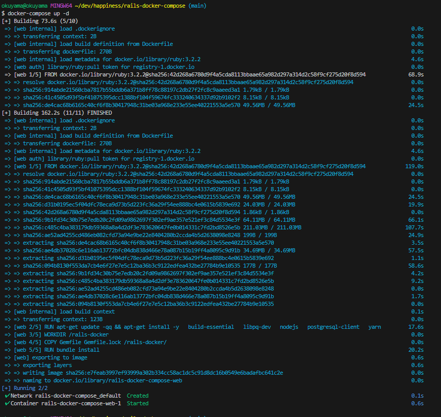

##　ファイル作成後にまずやること
```
docker-compose up -d
```
コマンドの解説
-dは「ディタッチモード」（Detached Mode）
「docker-compose up -d」というコマンドは、Docker Composeを使用して定義されたコンテナをバックグラウンドで起動するためのコマンドです。

docker-compose: Docker Composeコマンドの基本部分です。
up: Docker Composeによって定義されたコンテナを起動するためのオプションです。
-d: バックグラウンドでコンテナを実行するためのオプションです。このオプションを指定することで、コンテナが端末セッションに影響を与えずに実行されます。

ディタッチモードで実行したコンテナは、後から「docker logs」コマンドなどを使用してログを確認することができます。また、必要に応じて「docker stop」コマンドを使用してコンテナを停止させることもできます。

ディタッチモードを使用する際には、コマンドやツールによってはログや出力がターミナルに表示されないため、正常に動作しているかどうかを確認する場合はログや他の手段を活用する必要があります。
### 実行結果画像


Docker Compose設定ファイルの読み込み: docker-compose up -d コマンドを実行すると、カレントディレクトリにある docker-compose.yml ファイル（設定ファイル）が読み込まれます。

イメージのビルドまたは取得: 設定ファイルには、使用するDockerイメージの情報が記述されていることが一般的です。もしそのイメージがホスト上に存在しない場合、Dockerはイメージを取得（ダウンロード）します。また、設定ファイルにビルド指示が含まれている場合、Dockerは指定されたソースコードからイメージをビルドします。

コンテナの作成と起動: イメージが用意されたら、Dockerはそれを基に新しいコンテナを作成します。設定ファイルには、コンテナの設定や依存関係が含まれており、それに従ってコンテナが構築されます。これにはネットワークの設定、ボリュームのマウント、環境変数の設定などが含まれます。

コンテナの起動: コンテナが作成されたら、-d オプションによりバックグラウンドでコンテナが起動されます。これにより、コンテナがバックグラウンドで実行され、ターミナルセッションがブロックされることなく他の作業を続けることができます。

docker-compose up -d を実行することで、設定ファイルに記述された複数のコンテナが必要な設定で作成され、それらがバックグラウンドで起動されます。これにより、複雑なアプリケーション環境を簡単に構築し、実行することが可能となります。

### docker psで実行中のDockerコンテナの一覧を表示
```
docker ps
```
実行中のDockerコンテナの一覧を表示するためのコマンドです。

```
docker ps -a
```
実行中のコンテナだけでなく、停止中のコンテナも含めてすべてのコンテナの情報を表示することができます。
```
docker ps -a
CONTAINER ID   IMAGE                      COMMAND   CREATED          STATUS          PORTS                    NAMES
96125166473c   rails-docker-compose-web   "irb"     15 minutes ago   Up 15 minutes   0.0.0.0:3000->3000/tcp   rails-docker-compose-web-1

```

### 実行中の複数のコンテナを削除
コンテナが実行中である場合、削除する前にコンテナを停止する必要があります。コンテナを停止するには、docker stop コマンドを使用します。
```
docker stop container1 container2
```
```
docker rm container1 container2
```
### Dockerシステム内の未使用のリソースを一括で削除するためのコマンド
```
docker system prune
```
具体的には、以下のようなリソースを削除することができます：
- 未使用の停止中のコンテナ
- 未使用のネットワーク
- 未使用のイメージ（Dockerイメージのキャッシュやダングリングイメージ）
- 未使用のボリューム（Dockerボリューム）


### コンテナに入って作業するコマンド
```
docker-compose exec web bash
```
lsでコンテナの中を確認
```
$ docker-compose exec web bash
root@96125166473c:/rails-docker# ls
Docker-compose.yml  Dockerfile  Gemfile  Gemfile.lock  images  md
root@96125166473c:/rails-docker#
```
コンテナから抜ける
```
exit
```


## Railsのセットアップ
以下のコマンドを実行してRailsのセットアップを行います。

```
rails new . --force --database=postgresql --skip-bundle
```
```
exit
```
Gemfileが新しくなったので、再度ビルドを行います。


```
docker-compose down
```
```
$ docker-compose up --build -d
```

## docker-composeコマンド

```
docker-compose build
```
```
docker-compose up
```
```
docker-compose ps
```
```
docker-compose exec <service> <command>
```
具体的には
```
docker-compose exec web bash
```
### 便利コマンド
```
docker-compose up --build: build
```
```
docker-compose down: stop
```
